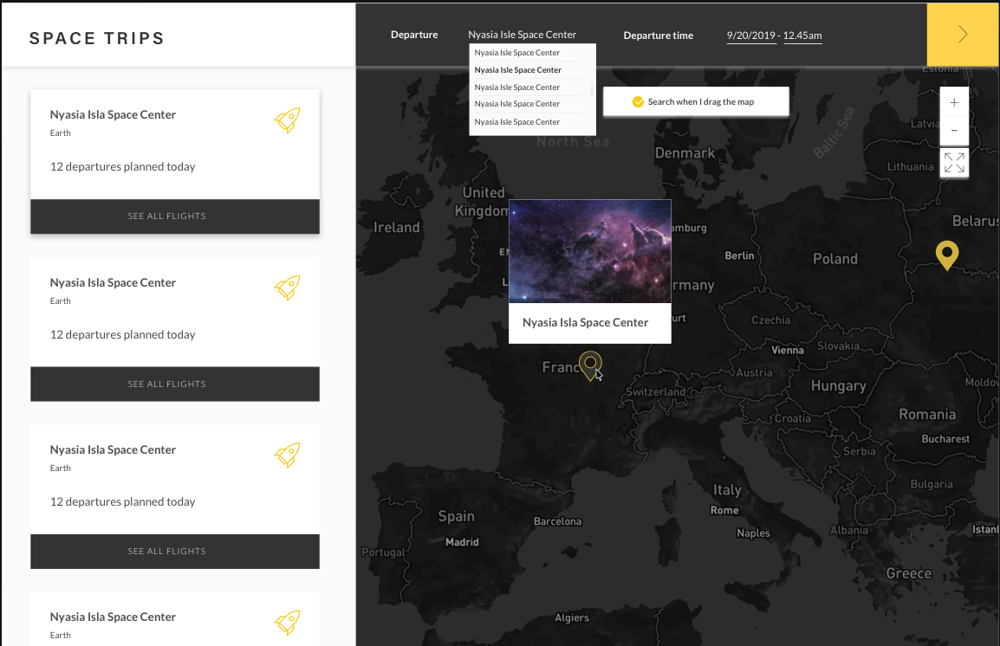

# Strapi Front-End Test

Let's develop the first Spacetrip booking application in the world 🚀🚀🚀!

<p align="center">

</p>

---

## Table of Content

- [Specifications](#specifications)
  - [Map component](#map-component)
    - [Business rules](#business-rules)
    - [Interaction dependencies](#interaction-dependencies)
  - [Searchbar component](#searchbar-component)
    - [Business rules](#business-rules-1)
    - [Interaction dependencies](#interaction-dependencies-1)
  - [List component](#list-component)
    - [Business rules](#business-rules-2)
    - [Interaction dependencies](#interaction-dependencies-2)
- [What does Strapi expect?](#what-does-strapi-expect-)
- [Environment](#environment)
  - [Back-end](#back-end)
  - [Frontend](#frontend)
- [TIPS](#tips)

## Specifications

As part of the hiring process, you have to create an application with 3 components:

- a `<Map />` component to display all Space centers on earth
- a `<List />` component to provide information about the different flights taking off from these Space centers
- and a `<SearchBar />` component to provide a search functionality related to this context


### Map component

The map component aims to show the different Space centers across the world and put a marker at their positions.

#### Business rules

- [ ] When the user navigates on the map it updates the visible Space centers on the map
- [ ] When the user clicks on a marker of the map, the list is scrolled to the selected element and the list item rocket icon bounces for 3s (see _"Interaction dependencies"_ below)
- [ ] When the user clicks on a marker of the map, it shows a popup with the Space center details
- [ ] `<GeolocateControl />` must be implemented (related to [react-map-gl](https://visgl.github.io/react-map-gl/))
- [ ] `<NavigationControl />` must be implemented (related to [react-map-gl](https://visgl.github.io/react-map-gl/))

#### Interaction dependencies

The map communicates with the `<List />` component to scroll to the selected element.

### Searchbar component

The searchbar component shows two fields that acts as filters on the map and the list:

- Departure
- Departure time

#### Business rules

- [ ] The `<SearchBar />` uses Algolia autocomplete in order to retrieve Space centers
- [ ] When a Space center is selected it:
  - [ ] centers the map to this selected Space center position
  - [ ] scrolls the list to this selected Space center position
  
_The two last checkboxes involve interaction dependencies, see below_.


#### Interaction dependencies

The searchbar communicates with the `<List />` component to scroll to the selected element.

The searchbar communicates with the `<Map />` component to center it on the selected Space center position.

### List component

The list shows all the Space centers shown in the `<Map />` component and it provides more information such as:

- The destination planet
- The number of flights taking off on the "Departure time" field provided by the `<Searchbar />`

#### Business rule

- [ ] When the user hovers a card, it changes the color of the according Space center marker on the map (see _"Interaction dependency"_ below)


#### Interaction dependencies

The list communicates with the `<Map />` component to highlight somehow the corresponding marker.

## What does Strapi expect?

Please check all the following items for your assessment to meet our expectations:

- [ ] At least one pertinent automated test has been written
- [ ] [Apollo (graphql)](https://www.apollographql.com/) is used
- [ ] [react-map-gl](https://visgl.github.io/react-map-gl/) is used
- [ ] A geosearch functionality based on the actual map region is made using [Algolia](https://www.algolia.com/doc/)
- [ ] [styled-components](https://styled-components.com/) is used
- [ ] A README.md file describing project setup (commands to run, environment variables, etc.) and tradeoffs you have made


**:warning: Remember that if one these elements is not provided, we won't be able to validate the assessment.**

## Environment

### Back-end

You're provided with a [`docker-compose.yml`](./docker-compose.yml) file that spawns a backend for you: **you don't have to create one**.

In order to start the containers, run the following in a terminal:

```sh
$ docker-compose up -d
```

After spawning them up, you will be available to access a Graphql API (+ playground) on `http://localhost:3000/graphql`.

We strongly advice to play with the different queries available on the Graphql Playground in order to use the good ones.

**Note:**

When setting up your Graphql configuration (on the frontend), make sure to pass the following header in order to be able to have access to the queries:

```json
{
  "Authorization": "Bearer API_KEY"
}
```

### Frontend

As mentioned in the previous section, we expect you to use specific tools. Here's a list of these tools:

- [Create React App](https://create-react-app.dev/)
- [Algolia](https://www.algolia.com/doc/)
- [GraphQL](https://www.apollographql.com/docs/react/)
- [React Map GL](https://uber.github.io/react-map-gl/#/Documentation/introduction/introduction)
- [Styled Components](https://www.styled-components.com)

---

## TIPS

- The `objectId` retrieved from the algolia's API is different than the one from the provided back-end so you can't use that one to redirect the user on the Space center's flights list page.

- [Algolia]('./tips/Algolia.md')
- [Map]('./tips/Map.md')
